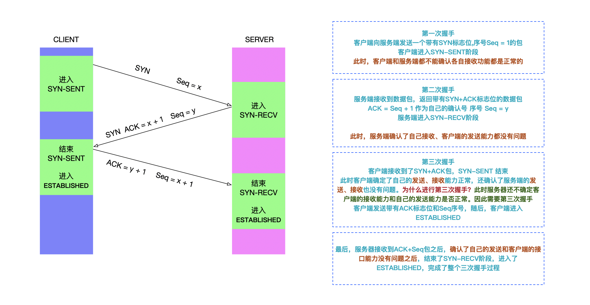

# TCP 连接

HTTP是超文本**传输协议，顾名思义，**传输数据的话，肯定需要管道或者传输途径，而在HTTP中安全的、有序的传输数据包，离不开TCP协议（位于传输层）。

这里简述有关TCP连接有关系的基本知识点，客户端和服务器建立TCP连接，然后客户端向服务器发送HTTP请求，服务器响应HTTP请求。然后关闭TCP连接（如果客户端在发送HTTP请求时，加上Connection: keep-alive，则此连接为持久连接）。

如果客户端每次发送HTTP请求都要进行TCP连接，这样串行请求不但会降低整个请求耗时，而且会严重影响页面呈现效率。因此出现了并行连接，并行连接提高了页面呈现效率，但是浪费了过多的带宽以及消耗了过多的内存。因此又出现了持久连接，能够在一个TCP连接上发送多个HTTP请求，为了进一步优化，后续出现了管道化连接以及可复用连接。

### TCP 三次握手

先来看一张图

